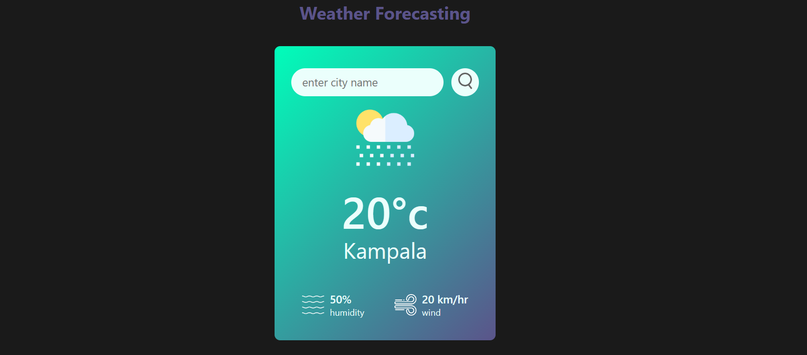
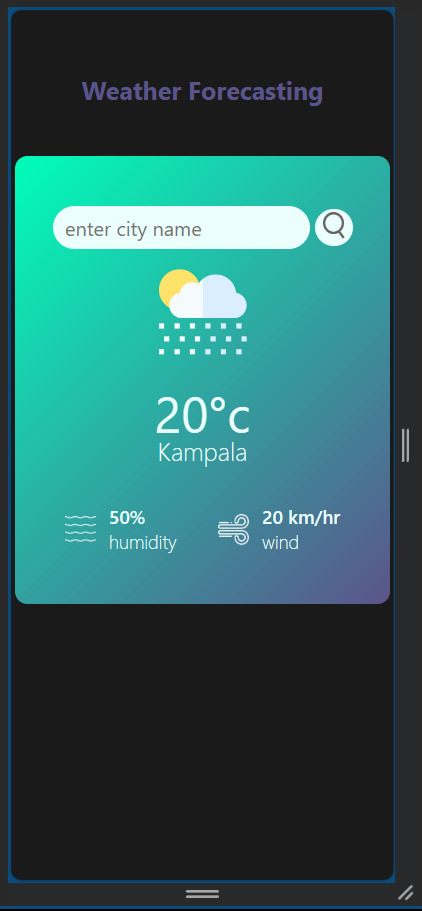

## A Javascript Responsive Weather App

A javascript weather app that focuses on the use and calling of API's and a responsive design principals .

### This project was created to demostrate the use of javascript async functions for calling on api urls and using them in the project plus a responsive design using css3.

##### Getting Started

###### Prerequisites

- Create an account and get an activated api key from open weather app by follwing the signup steps incase u have no account yet.
- The api key woould take some hours to get activated and ready to be used.

Installing

1. Clone the repositrory to your local machine

```
git clone git@github.com:Hashmozy/weather-app.git
```

2. Navigate to the directory

```
cd weather-app
```

3. run the project

```
node app.js / might run on live server as well
```

###### Usage

This project can be used for learning

## web view



## mobile view


